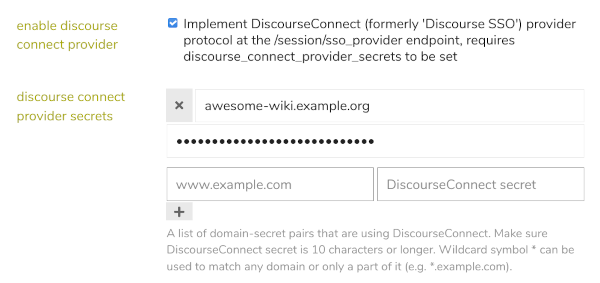

# Discourse SSO Consumer for MediaWiki

`DiscourseSsoConsumer` is a
[MediaWiki](https://www.mediawiki.org/wiki/MediaWiki) extension which
allows a MediaWiki site to authenticate users via the built-in SSO-provider
functionality of a [Discourse](https://discourse.org/) discussion forum.

The `DiscourseSsoConsumer` extension is itself a plugin for MediaWiki's
[`PluggableAuth`](https://www.mediawiki.org/wiki/Extension:PluggableAuth)
extension.

---

**Brought to you by...** [](https://www.centertap.org/)

This extension is developed by the
[Center for Transparent Analysis and Policy](https://www.centertap.org/),
a 501(c)(3) non-profit organization.  If this extension is useful
for your wiki, consider making a
[donation to support CTAP](https://www.centertap.org/how).
You can be a provider for Discourse SSO Consumer!

---

## Installation

The recommended installation method is to use
[`composer`](https://getcomposer.org/).  This will automatically install any
dependencies, e.g.,
[`PluggableAuth`](https://www.mediawiki.org/wiki/Extension:PluggableAuth).

 > You can install this extension by hand (e.g., `git clone` this repository
 > into your site's `extensions/` directory), but then you will have to
 > manage its dependencies by hand as well.

 * Go to your MediaWiki installation directory and run two `composer` commands:
   ```
   $ cd YOUR-WIKI-INSTALL-DIRECTORY
   $ COMPOSER=composer.local.json composer require --no-update centertap/discourse-sso-consumer
   $ composer update centertap/discourse-sso-consumer --no-dev --optimize-autoloader
   ```
   If you want to pin the major version of this extension (so that future
   updates do not inadvertently introduce breaking changes), change the first
   command to something like this (e.g., for major revision "194"):
   ```
   $ COMPOSER=composer.local.json composer require --no-update centertap/discourse-sso-consumer:^194.0.0
   ```
 * Edit your site's `LocalSettings.php` to load the extension(s):
   ```php
   ...
   wfLoadExtension( 'PluggableAuth' );
   wfLoadExtension( 'DiscourseSsoConsumer' );
   ...
   ```
 * Run `update.php` to add this extension's tables to your wiki's database:
   ```
   $ cd YOUR-WIKI-INSTALL-DIRECTORY
   $ cd maintenance
   $ php update.php
   ```
 * Continue onward to configure Discourse and MediaWiki.

## Configuring Discourse

At a minimum, you will need to enable the "DiscourseConnect Provider"
functionality and set up a site/shared-key on your Discourse server.

Go to `Admin -> Settings -> Login` and:
 * Set `enable discourse connect provider`.
 * Add your wiki site and a secret to `discourse connect provider secrets`.
   * Choose a good secret (e.g., use a password generator).



If you plan to configure MediaWiki to propagate logouts to Discourse (by
setting `$wgDiscourseSsoConsumer_EnableDiscourseLogout` to `true`), then
you will also need generate an API key for the `log_out` API.

Go to `Admin -> API` and:
 * Click `New API Key`.
 * Enter:
   * *Description:* (anything you want)
   * *User Level:* **Single User**
   * *User:* **system**
   * *Scope:* **Granular**
   * *Scopes:* enable **users: log out**
 * Hit `Save` and keep a copy of the generated key for
   `$wgDiscourseSsoConsumer_LogoutApiKey` in MediaWiki.

Make sure your MediaWiki server can connect directly to your Discourse
server.  The `log_out` API request is made by MediaWiki directly to
your Discourse server (unlike the SSO request for logging in, which is
redirected through the user's browser).

## Configuring MediaWiki

The complete set of configuration parameters is listed below.  At a
minimum, you will need to set the `DiscourseUrl` and `SsoSharedSecret`
parameters, in concert with the Discourse site.

As mentioned in the `PluggableAuth` documentation, you will likely want to
configure the MediaWiki permissions to allow extensions to automatically
create new local accounts for authenticated users.  Add something like this
to `LocalSettings.php`:

  >```php
  ># Allow auth extensions to generate new local users.
  >$wgGroupPermissions['*']['autocreateaccount'] = true;
  >```

When `DiscourseSsoConsumer` loads, it will automatically plug itself into
the `PluggableAuth` extension.  You may want to tune the configuration of
[`PluggableAuth`](https://www.mediawiki.org/wiki/Extension:PluggableAuth),
in particular:

 * `$wgPluggableAuth_EnableAutoLogin`
 * `$wgPluggableAuth_EnableLocalLogin`
 * `$wgPluggableAuth_EnableLocalProperties`
 * `$wgPluggableAuth_ButtonLabelMessage`
 * `$wgPluggableAuth_ButtonLabel`

You may also want to adjust `$wgObjectCacheSessionExpiry`, which controls
how long it takes for an inactive user to be automatically logged out.
See `$wgDiscourseSsoConsumer_AutoRelogin` below for more details.

### Configuration Parameters

 * `$wgDiscourseSsoConsumer_DiscourseUrl`
   * *mandatory string - no default value*
   * Specifies the base URL of the Discourse server, typically of the form
     `https://my-discourse-server.example.org` (no trailing slash).

 * `$wgDiscourseSsoConsumer_SsoProviderEndpoint`
   * string, default value: `/session/sso_provider`
   * Specifies the SSO provider endpoint of the Discourse server; a complete
     URL will be constructed by prepending `DiscourseUrl`.

 * `$wgDiscourseSsoConsumer_SsoSharedSecret`
   * *mandatory string - no default value*
   * Specifies the secret shared with the Discourse server, via its
     `discourse connect provider secrets` setting.

 * `$wgDiscourseSsoConsumer_EnableDiscourseLogout`
   * boolean, default value: `false`
   * If `true`, logging out of MediaWiki will also log the user out of
     Discourse.  If `true`, then `$wgDiscourseSsoConsumer_LogoutApiKey`
     must be set to an API key obtained from the Discourse server.

 * `$wgDiscourseSsoConsumer_LogoutApiEndpoint`
   * string, default value: `/admin/users/{id}/log_out.json`
   * Endpoint for the log_out API of the Discourse server; complete
     URL will be constructed by prepending `DiscourseUrl`.  The
     substring `{id}` will be replaced by the logged-out user's id.

 * `$wgDiscourseSsoConsumer_LogoutApiUsername`
   * string, default value: `system`
   * Username for Discourse log_out API.

 * `$wgDiscourseSsoConsumer_LogoutApiKey`
   * *string - no default value*
   * Key for Discourse log_out API, generated by Discourse server.  Must
     be set if `EnableDiscourseLogout` is `true`.

 * `$wgDiscourseSsoConsumer_LinkExistingBy`
   * array, default value: `[ ]` (empty array)
   * Array of zero or more instances of `email` and/or `username` in
     any order, specifying how to link Discourse credentials to existing
     MediaWiki accounts.

     `DiscourseSsoConsumer` keeps track of the association of Discourse
     user id's to MediaWiki user id's.  When it encounters Discourse
     credentials with a novel id, it will attempt to find a matching
     MediaWiki user by iterating through the methods specified in
     `LinkExistingBy`.  The `email` method will look for a matching email
     address.  The `username` will look for a matching canonicalized
     username.  If the list is exhausted without finding a match (or if no
     methods are specified), a new MediaWiki account will be created.

 * `$wgDiscourseSsoConsumer_ExposeName`
   * boolean, default value: `false`
   * Specifies whether or not a Discourse user's full name will be
     exposed to MediaWiki.  The privacy controls of Discourse and
     MediaWiki are different and difficult to harmonize.  If names are
     not completely public in the Discourse site policy, it is probably
     best not to expose them to MediaWiki at all.

     This setting affects the realname reported to `PluggableAuth`, which
     will by default update the realname of the account.  If `ExposeName`
     is `true`, the local realname will be set to the name in the Discourse
     SSO credentials; if `false`, the local realname will be set to an
     empty string.

     See `$wgPluggableAuth_EnableLocalProperties` if you want it to leave
     the local realname alone completely.

 * `$wgDiscourseSsoConsumer_ExposeEmail`
   * boolean, default value: `false`
   * Specifies whether or not a user's email address will be exposed to
     MediaWiki.  The privacy controls of Discourse and MediaWiki are
     different and difficult to harmonize.  If email addresses are not
     completely public in the Discourse site policy, it is probably best
     not to expose them to MediaWiki at all.

     This setting affects the email address reported to `PluggableAuth`,
     which will by default update the email address of the account.  If
     `ExposeEmail` is `true`, the local email address will be set to the
     email address in the Discourse SSO credentials; if `false`, the local
     email address will be set to an empty string.

     See `$wgPluggableAuth_EnableLocalProperties` if you want it to leave
     the local email address alone completely.

 * `$wgDiscourseSsoConsumer_GroupMaps`
   * array, *optional - no default value*
   * Specifies how MediaWiki group memberships should be derived from
     Discourse credentials.  If set, it should be an array of the form

     ```php
     [ 'MW-GROUP-1' => [ 'D-GROUP-X', 'D-GROUP-Y', ... ],
       'MW-GROUP-2' => [ 'D-GROUP-A', 'D-GROUP-B', ... ], ]
     ```

     where each entry specifies that membership in the given MediaWiki
     group is strictly determined by membership in at least one of the
     listed Discourse groups.  Membership in the specified groups will be
     toggled according to the SSO credentials on each login; groups which
     are not mentioned in `GroupMaps` will not be touched.

     The two special tokens `@ADMIN@` and `@MODERATOR@` represent the
     `is_admin` and `is_moderator` flags in the SSO credentials.  For example,

     ```php
     $wgDiscourseSsoConsumer_GroupMap = [ 'sysop' => [ '@ADMIN@' ],
                                          'bureaucrat' => [ '@ADMIN@' ] ];
     ```

     will cause a user's membership in the `sysop` and `bureaucrat` groups
     to be set according to the `is_admin` flag in the SSO credentials
     upon every login.  Membership in any other MediaWiki groups will not
     be affected.

 * `$wgDiscourseSsoConsumer_EnableAutoRelogin`
   * boolean, default value: `false`
   * If `true`, automatically re-login a previously-logged-in user if they
     become logged out due to, e.g., session timeout.
   * The purpose of this option is to provide a user experience more similar
     to Discourse itself, i.e., as long as the user is logged-in to Discourse,
     they will stay logged-in to MediaWiki.  Without this enabled, the user
     will be silently logged out of MediaWiki after a period of inactivity
     when their current session times out (by default, after one hour,
     as set by `$wgObjectCacheSessionExpiry`).
   * If you enable this option, you will probably want to _disable_
     `$wgPluggableAuth_EnableLocalLogin`, otherwise users will have to
     see the `Userlogin` interstitial page, and click through to
     Discourse SSO, every time a relogin occurs.
   * This option is different from `$wgPluggableAuth_EnableAutoLogin`.

     `PluggableAuth`'s `EnableAutoLogin`:
       * will always redirect unregistered users to the login flow;
       * will disable the user's `Log out` button;
       * will prevent anonymous access to the wiki.

     `DiscourseSsoConsumer`'s `AutoRelogin`:
       * will only redirect a previously logged-in user to the login flow;
       * will not disable logout (and will not try to re-login after a user
         does explicitly logout);
       * will not prevent anonymous access to the wiki.

      There is no point in having both modes enabled at the same time.
      Choose one or the other (or neither).

## Release Notes

See [`RELEASE-NOTES.md`](RELEASE-NOTES.md).

## Known Bugs

See `TODO` comments in the source code.

## License

This work is licensed under GPL 3.0 (or any later version).

`SPDX-License-Identifier: GPL-3.0-or-later`
